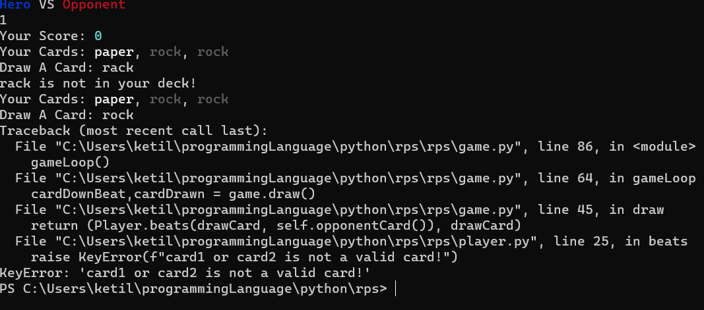

# Invalid Card Name Glitch 

## NAME

* Invalid Card Glitch

## STEPS

1. write an invalid input (ie. rack instead of rock)
2. write a valid input (ie. writing rock when the rock card is in deck)

## LOCATION

* A `KeyError` is raised in function `Player.beats()` when checking the cards against each other

## IMAGE SHOWCASE
